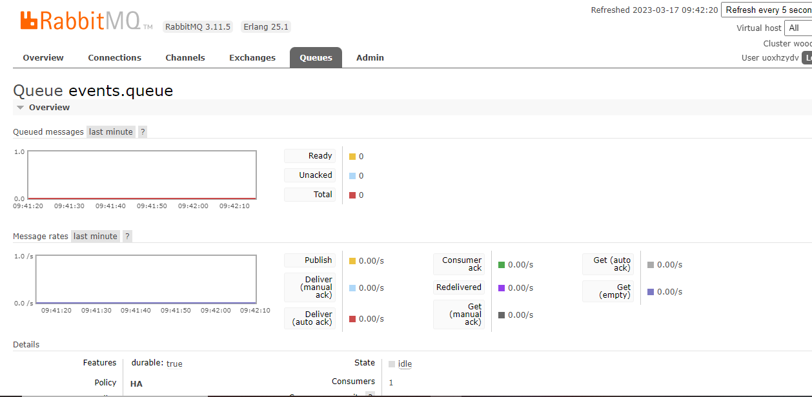
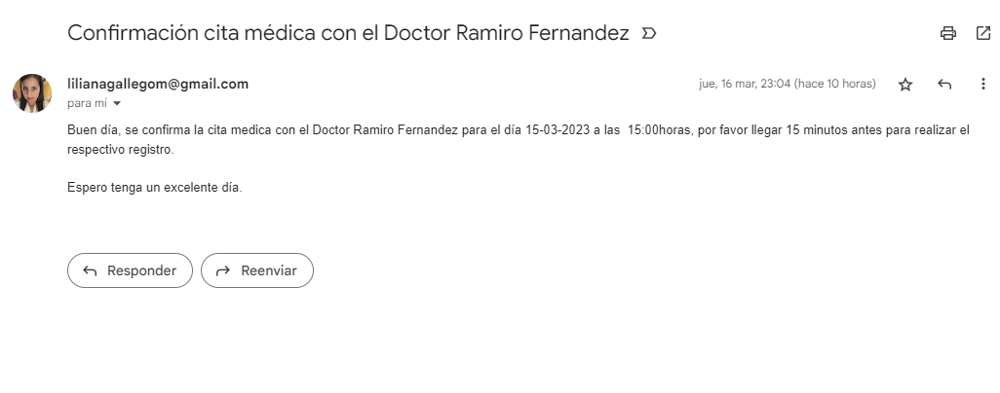

# APP MENSAJERÍA-RESERVAS CITAS MÉDICAS

El presente repositorio contiene el proyecto para consumir los eventos enviados
a la cola de RabbitMQ y la configuración para enviar una notificación al correo electrónico
de la cita reservada

- RabbitMQ

- Correo de notificación

Tecnologías utilizadas:

-  [Java 11](https://www.oracle.com/technetwork/java/javase/downloads/jdk8-downloads-2133151.html)
   <image src="https://miro.medium.com/max/754/1*SYPAgsWPGGM9y3zN2B7LGQ.png">

-  IDE: [IntelliJ IDEA](https://www.jetbrains.com/idea/)
   <image src="https://pbs.twimg.com/profile_images/1206618215767584769/zl48EuhC_400x400.jpg" alt="IntelliJ IDEA" height="200">
-  Test: [Junit](https://junit.org/junit5/)
   <image src="https://pragmatic-qa.com/wp-content/uploads/2019/05/Junit5-660x371.jpg">

-  Test: [Mockito](https://site.mockito.org/)
   <image src="https://raw.githubusercontent.com/mockito/mockito/main/src/javadoc/org/mockito/logo.png">

### Autor
[@LilianaGallego](https://github.com/LilianaGallego) - Liliana Gallego